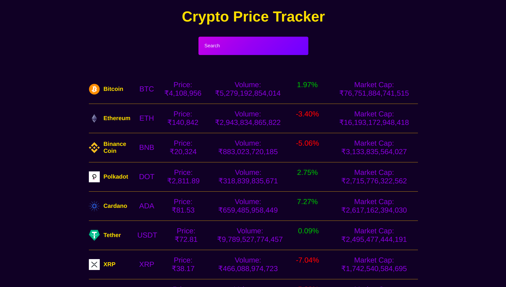
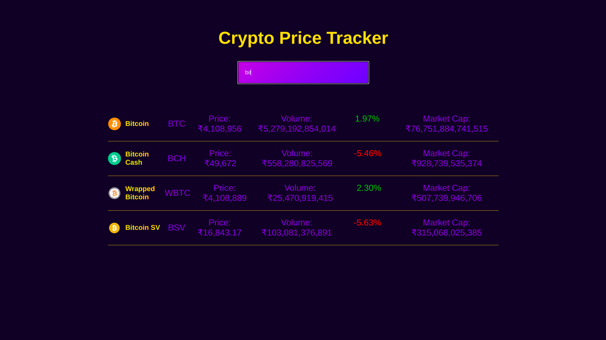

# Cryptocurrency Price Tracker

This project has been deployed at [this link](https://crypto-pricetracker.herokuapp.com/).

## Screenshots

## About the Project

This single page application has been designed using ReactJS for a smooth and fast UI. Functional Components along with React Hooks have been made use of for state management, useEffect() has been used to fetch cryptocurrency data on initial mount of the component. useState() is used to store the coins data in an array and the search input entered by the user as a string. Event handlers have been used to update the App.js component's state.
Object Destructuring has been used to pass the coin data as props to Coin.js component. This is the component which will render all the Cryptocurrency data initially and later on showing only necessary results as the user searches.
Array filter and map functions have been made use of to get matching results as user enter words in the search box.

## Available Scripts

### `yarn install`

Installs all the dependencies of the project.
If you don't have yarn installed, you can run the command `npm install --global yarn`. To download NodeJS on your system if you already don't have it installed, you can download it from [here](https://nodejs.org/en/).

In the project directory, you can run:

### `yarn start`

Runs the app in the development mode.\
Open [http://localhost:3000](http://localhost:3000) to view it in the browser.

The page will reload if you make edits.\
You will also see any lint errors in the console.

### Acknowledgements

[Youtube Video](https://www.youtube.com/watch?v=9ohK7CapmIs) By Brian Design
